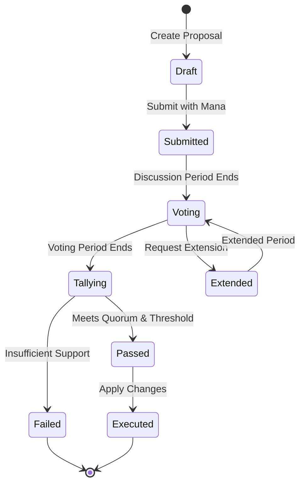

# ICN Governance System

## Overview

The InterCooperative Network governance system enables participatory decision-making through a formal proposal and voting mechanism. All network parameters, protocol upgrades, and policy changes are governed through transparent, verifiable processes that respect the federated nature of the network.

## Core Principles

### 1. Participatory Democracy
- All network participants can engage in governance processes
- Multiple levels of representation (individual, cooperative, federation)
- Transparent decision-making with verifiable outcomes

### 2. Federated Authority
- Different governance levels for different scopes of decisions
- Local autonomy within global coordination
- Subsidiarity principle: decisions made at appropriate levels

### 3. Explicit Policy
- All rules encoded as verifiable governance policies
- Version-controlled policy evolution
- CCL (Cooperative Contract Language) compilation to WASM

### 4. Economic Alignment
- Mana-based participation costs prevent spam
- Stake-based voting aligns incentives
- Economic consequences for governance outcomes

## Governance Architecture

### Proposal Lifecycle



### Governance Levels

#### Individual Level
- **Scope**: Personal settings, delegation preferences
- **Participants**: Individual DID holders
- **Threshold**: Simple majority (self)
- **Examples**: Reputation delegation, personal mana policies

#### Cooperative Level  
- **Scope**: Cooperative internal policies, resource allocation
- **Participants**: Cooperative members
- **Threshold**: Configurable (typically 50-75%)
- **Examples**: Member admission, resource sharing rules, internal governance

#### Community Level
- **Scope**: Multi-cooperative coordination, shared infrastructure
- **Participants**: Cooperative representatives + individuals
- **Threshold**: Weighted voting based on stake/participation
- **Examples**: Shared services, dispute resolution, community standards

#### Federation Level
- **Scope**: Protocol changes, network-wide parameters
- **Participants**: Community representatives + major stakeholders
- **Threshold**: High threshold (67-80%) + technical review
- **Examples**: Protocol upgrades, mana parameters, network topology

## Proposal Types

### Parameter Proposals
Modify existing network parameters without code changes:

```rust
pub struct ParameterProposal {
    pub parameter_path: String,        // e.g., "mana.base_regeneration_rate"
    pub current_value: serde_json::Value,
    pub proposed_value: serde_json::Value,
    pub rationale: String,
    pub impact_analysis: ImpactAnalysis,
}
```

**Examples**:
- Mana regeneration rates
- Job cost multipliers  
- Voting thresholds
- Reputation parameters

### Policy Proposals
Introduce or modify governance policies via CCL:

```rust
pub struct PolicyProposal {
    pub policy_name: String,
    pub policy_version: SemanticVersion,
    pub ccl_source: String,
    pub compiled_wasm: Vec<u8>,
    pub policy_scope: GovernanceLevel,
    pub supersedes: Option<String>,
}
```

**Examples**:
- New economic models
- Membership criteria
- Dispute resolution procedures
- Resource allocation algorithms

### Protocol Proposals
Major protocol changes requiring code modifications:

```rust
pub struct ProtocolProposal {
    pub title: String,
    pub specification: String,
    pub implementation_plan: ImplementationPlan,
    pub compatibility_impact: CompatibilityAssessment,
    pub migration_strategy: MigrationStrategy,
    pub testing_requirements: TestingRequirements,
}
```

**Examples**:
- New consensus mechanisms
- API changes
- Cryptographic upgrades
- Federation topology changes

### Constitutional Proposals
Fundamental changes to governance itself:

```rust
pub struct ConstitutionalProposal {
    pub governance_change: GovernanceChange,
    pub voting_threshold_change: Option<VotingThresholds>,
    pub representation_change: Option<RepresentationModel>,
    pub emergency_procedures: Option<EmergencyProcedures>,
    pub ratification_requirements: RatificationRequirements,
}
```

**Examples**:
- Voting mechanism changes
- Quorum requirements
- Emergency procedures
- Rights and responsibilities

## Voting Mechanisms

### Voting Systems

#### Simple Majority
- **Use**: Basic parameter changes
- **Threshold**: 50% + 1 of votes cast
- **Quorum**: Minimum participation required

#### Supermajority
- **Use**: Significant protocol changes
- **Threshold**: 67% or 75% of votes cast
- **Quorum**: Higher minimum participation

#### Qualified Majority
- **Use**: Constitutional changes
- **Threshold**: 80%+ with additional requirements
- **Quorum**: Very high participation required

#### Consensus Building
- **Use**: Community decisions
- **Process**: Discussion until rough consensus
- **Fallback**: Formal voting if consensus impossible

### Voting Weight Calculation

#### Mana-Based Weight
```rust
fn calculate_mana_weight(voter: &Did, mana_balance: u64) -> f64 {
    let log_mana = (mana_balance as f64).ln();
    let weight = log_mana / 10.0; // Logarithmic scaling
    weight.min(100.0) // Cap maximum influence
}
```

#### Reputation Multiplier
```rust
fn apply_reputation_multiplier(base_weight: f64, reputation: ReputationScore) -> f64 {
    let multiplier = match reputation.level {
        ReputationLevel::Excellent => 1.5,
        ReputationLevel::Good => 1.2,
        ReputationLevel::Neutral => 1.0,
        ReputationLevel::Poor => 0.8,
        ReputationLevel::Suspicious => 0.5,
    };
    base_weight * multiplier
}
```

#### Stake-Based Adjustment
```rust
fn calculate_stake_weight(
    voter: &Did, 
    proposal_scope: &GovernanceLevel,
    stake: &StakeInformation
) -> f64 {
    match proposal_scope {
        GovernanceLevel::Cooperative => stake.cooperative_stake,
        GovernanceLevel::Community => stake.community_stake,
        GovernanceLevel::Federation => stake.federation_stake,
        GovernanceLevel::Individual => 1.0,
    }
}
```

### Vote Delegation

#### Direct Delegation
Delegate all voting power to a trusted representative:

```rust
pub struct DirectDelegation {
    pub delegator: Did,
    pub delegate: Did,
    pub scope: DelegationScope,
    pub expires_at: Option<Timestamp>,
    pub revocable: bool,
}
```

#### Topic-Based Delegation
Delegate voting power for specific governance areas:

```rust
pub struct TopicDelegation {
    pub delegator: Did,
    pub delegate: Did,
    pub topics: Vec<GovernanceTopic>,
    pub weight_percentage: f64, // 0.0 to 1.0
}
```

#### Liquid Democracy
Transitive delegation with override capabilities:

```rust
pub struct LiquidDelegation {
    pub delegation_chain: Vec<Did>,
    pub override_enabled: bool,
    pub delegation_depth: u8,
    pub loop_prevention: LoopPreventionStrategy,
}
```

## Implementation Architecture

### Core Components

#### GovernanceModule
Main governance service interface:

```rust
pub trait GovernanceModule {
    async fn submit_proposal(
        &self,
        proposer: &Did,
        proposal: &Proposal
    ) -> Result<ProposalId, CommonError>;
    
    async fn cast_vote(
        &self,
        voter: &Did,
        proposal_id: &ProposalId,
        vote: &Vote
    ) -> Result<(), CommonError>;
    
    async fn tally_votes(
        &self,
        proposal_id: &ProposalId
    ) -> Result<VotingResult, CommonError>;
    
    async fn execute_proposal(
        &self,
        proposal_id: &ProposalId
    ) -> Result<ExecutionResult, CommonError>;
}
```

#### Proposal Storage
Persistent storage for proposals and voting records:

```rust
pub struct ProposalStore {
    proposals: HashMap<ProposalId, Proposal>,
    votes: HashMap<ProposalId, Vec<Vote>>,
    results: HashMap<ProposalId, VotingResult>,
}
```

#### Voting Engine
Handles vote collection, validation, and tallying:

```rust
pub struct VotingEngine {
    weight_calculator: VoteWeightCalculator,
    delegation_resolver: DelegationResolver,
    quorum_checker: QuorumChecker,
    threshold_validator: ThresholdValidator,
}
```

### Integration Points

#### Economic System Integration
```rust
pub async fn submit_proposal(
    &self,
    proposer: &Did,
    proposal: &Proposal
) -> Result<ProposalId, CommonError> {
    // Charge mana for proposal submission
    self.economy_service
        .charge_mana(
            proposer, 
            OperationType::GovernanceProposal,
            self.governance_costs.proposal_submission
        )
        .await?;
    
    // Validate proposal format and requirements
    self.validate_proposal(proposal)?;
    
    // Store proposal
    let proposal_id = self.store_proposal(proposer, proposal).await?;
    
    // Announce to network
    self.network_service
        .broadcast_message(NetworkMessage::NewProposal {
            proposal_id: proposal_id.clone(),
            proposer: proposer.clone(),
        })
        .await?;
    
    Ok(proposal_id)
}
```

#### Runtime Integration
```rust
pub async fn execute_parameter_change(
    &self,
    parameter_proposal: &ParameterProposal
) -> Result<(), CommonError> {
    // Validate parameter path exists
    self.parameter_registry
        .validate_path(&parameter_proposal.parameter_path)?;
    
    // Apply parameter change
    self.runtime_config
        .update_parameter(
            &parameter_proposal.parameter_path,
            &parameter_proposal.proposed_value
        )
        .await?;
    
    // Log change for audit
    self.audit_log
        .record_parameter_change(parameter_proposal)
        .await?;
    
    Ok(())
}
```

## Governance Policies

### Voting Thresholds
Different proposals require different levels of support:

```yaml
voting_thresholds:
  parameter_changes:
    simple: 50%
    economic: 60%
    security: 75%
  
  policy_changes:
    local: 50%
    cooperative: 60%
    federation: 67%
  
  protocol_changes:
    minor: 60%
    major: 75%
    breaking: 80%
  
  constitutional:
    threshold: 80%
    ratification_period: 30_days
    multiple_rounds: true
```

### Participation Requirements
```yaml
participation_requirements:
  quorum:
    minimum_participation: 15%
    scaling_factor: 1.2  # Higher for important proposals
    
  eligibility:
    minimum_mana: 100
    minimum_reputation: "neutral"
    account_age_days: 30
    
  delegation:
    max_delegation_depth: 3
    delegation_cooldown: 24_hours
    revocation_notice: 48_hours
```

### Proposal Limits
```yaml
proposal_limits:
  per_identity:
    daily: 3
    weekly: 10
    monthly: 25
    
  concurrent:
    per_scope: 5
    total_active: 20
    
  submission_requirements:
    mana_cost: 1000
    documentation_minimum: 500_words
    impact_analysis_required: true
```

## Emergency Procedures

### Emergency Proposal Fast-Track
For critical security or stability issues:

```rust
pub struct EmergencyProposal {
    pub standard_proposal: Proposal,
    pub emergency_justification: String,
    pub security_impact: SecurityImpactAssessment,
    pub reversal_mechanism: ReversalMechanism,
    pub emergency_council_approval: Vec<Did>,
}
```

**Requirements**:
- Emergency council pre-approval (5 of 7 members)
- 24-hour voting window (instead of 7 days)
- Lower quorum requirements (10% vs 15%)
- Automatic reversal if found to be misused

### Network Halt Procedures
For extreme situations threatening network integrity:

```rust
pub struct NetworkHaltProposal {
    pub halt_scope: HaltScope,
    pub duration_limit: Duration,
    pub restart_conditions: Vec<RestartCondition>,
    pub emergency_override: EmergencyOverride,
}
```

**Authority Levels**:
- **Local Halt**: Cooperative can halt internal operations
- **Regional Halt**: Federation can halt regional coordination
- **Global Halt**: Requires 90%+ supermajority with emergency procedures

## Monitoring and Transparency

### Governance Metrics
```rust
pub struct GovernanceMetrics {
    pub proposal_statistics: ProposalStatistics,
    pub participation_rates: ParticipationRates,
    pub delegation_patterns: DelegationPatterns,
    pub decision_effectiveness: DecisionEffectiveness,
}
```

### Audit Trail
All governance actions recorded in immutable DAG:

```rust
pub struct GovernanceAuditRecord {
    pub timestamp: Timestamp,
    pub action: GovernanceAction,
    pub actor: Did,
    pub proposal_id: Option<ProposalId>,
    pub vote_hash: Option<Hash>,
    pub outcome: ActionOutcome,
    pub dag_anchor: Cid,
}
```

### Public Dashboards
Real-time governance transparency:
- Active proposals and voting status
- Participation rates by demographic
- Decision implementation tracking
- Economic impact of governance decisions

## Best Practices

### For Proposers
- Provide comprehensive rationale and impact analysis
- Engage in pre-proposal community discussion
- Consider phased implementation for large changes
- Prepare for questions and feedback during discussion period

### For Voters
- Research proposals thoroughly before voting
- Consider long-term impacts beyond immediate benefits
- Participate in discussion to improve proposals
- Use delegation responsibly for areas outside expertise

### For Delegates
- Clearly communicate voting philosophy and positions
- Provide regular updates to delegators
- Maintain transparency about potential conflicts of interest
- Allow delegation revocation with appropriate notice

The ICN governance system creates a balance between democratic participation and effective decision-making, enabling the network to evolve while maintaining stability and fairness. 